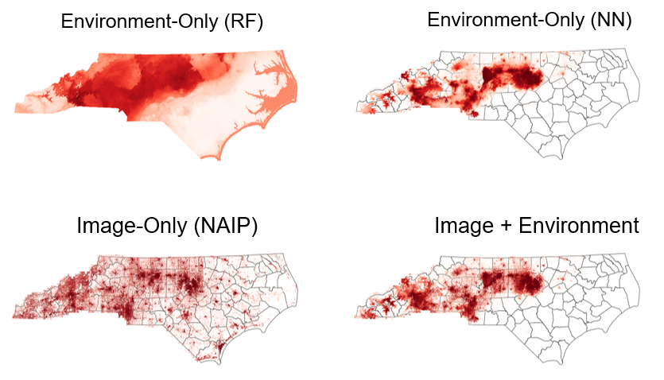

# Ailanthus NAIP Classification (US + Legacy NC Workflows)

This repository contains the training and data-preparation workflows used to classify **Tree-of-Heaven (_Ailanthus altissima_)** from **NAIP aerial imagery** and environmental predictors.

It now includes two parallel code paths:

1. **Current US-scale workflow** (`data_prep/`, `models/`) for nationwide data and model evaluation.
2. **Legacy North Carolina workflow** (`data_prep_legacy_nc/`, `models_legacy_nc/`) preserved for reproducibility of earlier experiments.



---

## Repository layout

- `configs_sweeps/` - sweep and experiment configuration files.
- `data_prep/` - current US-scale data collection and sampling scripts.
- `models/` - current US-scale model training/evaluation code.
- `data_prep_legacy_nc/` - legacy NC-only data preparation scripts.
- `models_legacy_nc/` - legacy NC-only model and evaluation scripts.
- `data_example/` - tiny sample dataset for smoke testing.

Each major directory contains a local README with script-level guidance.

---

## Installation

### Option A: Conda (recommended)

```bash
conda env create -f environment.yml
conda activate ailanthus-naip
```

### Option B: pip + venv

```bash
python -m venv .venv
source .venv/bin/activate  # Windows: .venv\Scripts\activate
pip install --upgrade pip
pip install -r requirements.txt
```

> **Note:** geospatial packages (`rasterio`, `geopandas`, `shapely`) are easiest to install with conda-forge.

---

## Quick start

### 1) Prepare data

Use the US-scale scripts in `data_prep/` to:
- collect/clean occurrence + background points,
- query/download NAIP imagery,
- create train/val/test CSVs for model input.

### 2) Configure an experiment

Edit `configs_sweeps/model_config.json` to set:
- file paths,
- model type (`image_climate`, `image_only`, `climate_only`),
- training hyperparameters.

### 3) Train the US-scale model

```bash
python models/main.py --config configs_sweeps/model_config.json
```

### 4) Evaluate / inference

- Use training artifacts from `output_dir/experiment_name`.
- Use `models/eval_model_us.py` and related scripts for evaluation and map products.

---

## Legacy NC workflow

The legacy NC pipeline is maintained for historical reproducibility and comparison.

- Data preparation scripts: `data_prep_legacy_nc/`
- Training/evaluation scripts: `models_legacy_nc/`

Use this workflow if you need to reproduce the earlier NC-only experiments.

---

## Testing

Run the lightweight documentation and structure checks:

```bash
pytest -q
```

These tests intentionally avoid requiring large raster/model assets.

---

## Citation

If this code is useful in your work, please cite:

> Lake, T. (2025). Classifying Tree-of-Heaven with NAIP imagery and environmental predictors. In prep.
